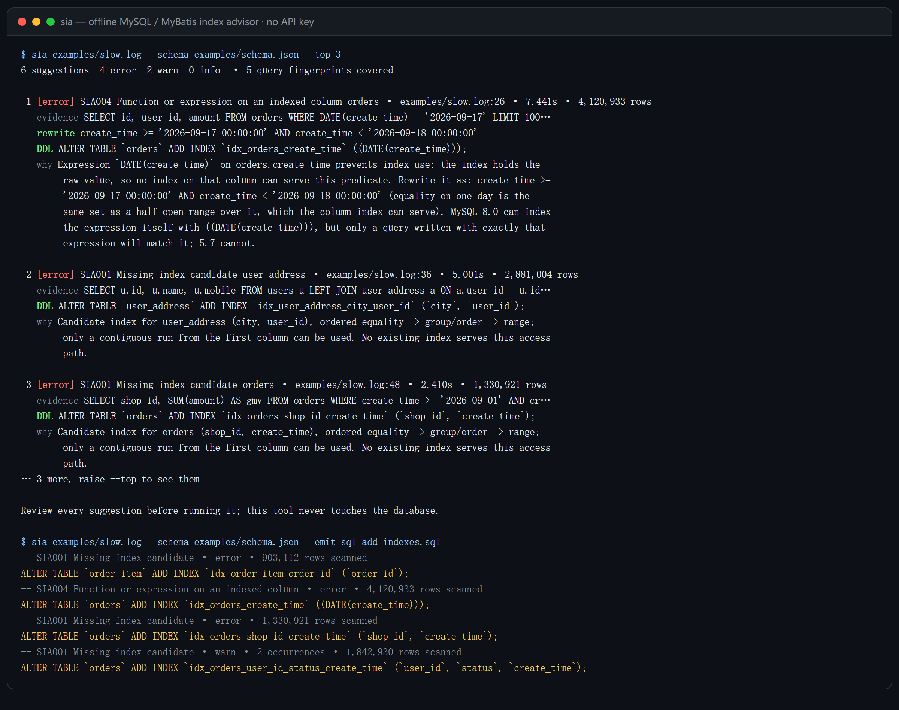

# sql-index-advisor

[](https://github.com/JingYu-create520/sql-index-advisor/actions/workflows/ci.yml) [](https://github.com/JingYu-create520/sql-index-advisor/releases/tag/v0.1.15) [](LICENSE)

**面向 MySQL / MyBatis 的离线索引顾问。慢查询日志进，索引建议 + 迁移 SQL 出。**



所有结论都由确定性规则产生，因此可复现、可单测、不需要 API key。LLM 只是可选的文案润色层，它无法新增、删除或重排任何一条建议。

<details>
<summary>同一次运行的纯文本版（方便复制；为了可读性省略了每条建议的「说明」段落）</summary>

```console
$ sia examples/slow.log --schema examples/schema.json

6 条建议  4 error  2 warn  0 info  · 覆盖 5 个查询指纹

 1 [error] SIA004 索引列上使用函数或运算 orders · examples/slow.log:26 · 7.441s · 4,120,933 rows
   证据 SELECT id, user_id, amount FROM orders WHERE DATE(create_time) = '2026-09-17' LIMIT 100…
   改写 create_time >= '2026-09-17 00:00:00' AND create_time < '2026-09-18 00:00:00'
   DDL     ALTER TABLE `orders` ADD INDEX `idx_orders_create_time` ((DATE(create_time)));

 2 [error] SIA001 缺失索引候选 user_address · examples/slow.log:36 · 5.001s · 2,881,004 rows
   证据 SELECT u.id, u.name, u.mobile FROM users u LEFT JOIN user_address a ON a.user_id = u.id…
   DDL     ALTER TABLE `user_address` ADD INDEX `idx_user_address_city_user_id` (`city`, `user_id`);

建议需人工评审后再执行；本工具永不自动改动数据库。

$ sia examples/slow.log --schema examples/schema.json --emit-sql add-indexes.sql
-- SIA001 缺失索引候选 · error · 扫描 903,112 行
ALTER TABLE `order_item` ADD INDEX `idx_order_item_order_id` (`order_id`);
-- SIA004 索引列上使用函数或运算 · error · 扫描 4,120,933 行
ALTER TABLE `orders` ADD INDEX `idx_orders_create_time` ((DATE(create_time)));
-- SIA001 缺失索引候选 · error · 扫描 1,330,921 行
ALTER TABLE `orders` ADD INDEX `idx_orders_shop_id_create_time` (`shop_id`, `create_time`);
-- SIA001 缺失索引候选 · warn · 命中 2 次 · 扫描 1,842,930 行
ALTER TABLE `orders` ADD INDEX `idx_orders_user_id_status_create_time` (`user_id`, `status`, `create_time`);
```

</details>

上面每一行都带规则 ID、判定所依据的 SQL，以及一条你可以先读懂再执行的 DDL。不喜欢某个结论时，你能追溯到它是哪个条件产生的。

English docs: [README.md](README.md)。

---

## 和大模型直接问的区别

你没法签字确认一个你没法复现的建议，这个工具就是冲着这一点做的。

| | 直接问模型 | sql-index-advisor |
|---|---|---|
| 知道你现有索引吗 | 不知道 | 知道（给 `schema.json`） |
| 同输入同输出 | 不保证 | 保证，且被测试锁死 |
| 无网络 / 无 key 能跑 | 不能 | 能，这就是默认状态 |
| 每条建议可追溯 | "相信我" | 规则 ID + 证据 + DDL |
| 能进 CI 门禁 | 不能 | 能，退出码 + PR 行级注解 |

接上 `--llm` 之后，端点只负责改写解释文案。有一条测试断言：开不开 `--llm`，findings 集合逐字节相同。

## 安装

直接走 GitHub 安装，没有 npm 包。

```bash
# 装一次，命令名是 sia
npm i -g github:JingYu-create520/sql-index-advisor

# 或者不装，一次性执行
npx --yes --package github:JingYu-create520/sql-index-advisor sia -- --help
```

需要 Node.js ≥ 18，运行时依赖 4 个，无原生编译。构建产物 `dist/` 是提交进仓库的，所以从 GitHub 安装不需要本机有构建链：npm 的 `prepare` 钩子在有 dev 依赖时会重新构建，没有就沿用仓库里那份。代价是 `ci.yml` 会重新构建并比对，`dist/` 和 `src/` 一旦不同步就让 CI 失败。

## 30 秒上手

```bash
# 1. 慢查询日志，按真实耗时排序
sia /var/log/mysql/slow.log

# 2. 上线前先看一条 SQL
sia query "SELECT * FROM orders WHERE user_id=1 ORDER BY create_time DESC LIMIT 20"

# 3. 整个 MyBatis 项目，并产出可评审的迁移文件
sia mapper src/main/resources/mapper --emit-sql migrations.sql

# 4. 给 agent 或脚本用
sia examples/slow.log --format json
```

### 搞一个 `schema.json`

拿不准的那几条规则，是拿你的查询和现有索引做比较的规则，它们需要这个文件。工具不连数据库，所以由你自己导：一条纯 `information_schema` 查询（已在真实 MySQL 8.0.46 上跑通）。

```bash
mysql --database=your_db --raw --skip-column-names < examples/schema-dump.sql > schema.json
sia slow.log --schema schema.json
```

没有它，`SIA002` / `SIA003` / `SIA005` / `SIA007` 会保持沉默，而且报告会明确说明它们为什么沉默。沉默永远不会被渲染成"没问题"。

### 完整闭环，跑在真库上

`examples/seed-schema.sql` 会建一个"故意少建索引"的库（20 万订单、40 万订单明细），让建议有真实靶子：

```bash
docker run -d --name sia-mysql -e MYSQL_ROOT_PASSWORD=sia -e MYSQL_DATABASE=demo -p 13307:3306 mysql:8.0
docker exec -i sia-mysql mysql -uroot -psia demo < examples/seed-schema.sql
docker exec -i sia-mysql mysql --raw --skip-column-names -uroot -psia demo < examples/schema-dump.sql > schema.json

sia query "SELECT * FROM orders WHERE user_id=42 AND status='PAID' ORDER BY create_time DESC LIMIT 20" \
    --schema schema.json --emit-sql add-indexes.sql
docker exec -i sia-mysql mysql -uroot -psia demo < add-indexes.sql
docker exec sia-mysql mysql -uroot -psia demo -e "EXPLAIN SELECT * FROM orders WHERE user_id=42 AND status='PAID' ORDER BY create_time DESC LIMIT 20\G"
```

改之前 `EXPLAIN` 只能退到不完整的 `idx_user_pay`，估算扫 23 行且带 `Using filesort`。用上推荐的 `(user_id, status, create_time)` 之后估算 1 行，filesort 消失。

## 规则

| ID | 名称 | 依赖 | 抓什么 |
|---|---|---|---|
| SIA001 | 缺失索引候选 | — | 访问路径无可用索引；列顺序按**等值 → 排序/GROUP BY → 范围** |
| SIA002 | 前缀索引 | schema | 过长的 `VARCHAR` / `TEXT` 进入谓词；阈值按**字节**算，不是 utf8mb3 时代的"255" |
| SIA003 | 最左前缀违反 | schema | 跳过复合索引中间列，`EXPLAIN` 的 `key` 看不出来，`key_len` 才看得出来 |
| SIA004 | 索引列上使用函数 | — | `DATE(create_time) = ?` → 左闭右开区间改写，8.0 另给函数索引方案；以 `%` 开头的 `LIKE` 会被明确报成「建索引也没用」，而不是当成没问题 |
| SIA005 | 隐式类型转换 | schema | `varchar列 = 123`，只有这个方向真的会让索引失效 |
| SIA006 | 深分页 | — | 字面量 `LIMIT 100000, 20` → 延迟关联 + 游标两种改写 |
| SIA007 | 覆盖索引机会 | schema + 慢日志 | 扫描行数高但投影窄 → 扩展索引消除回表 |

每条规则的完整判定依据、误报边界和示例：**[docs/rules.md](docs/rules.md)**。工具为什么长成现在这样：[docs/DESIGN-NOTES.md](docs/DESIGN-NOTES.md)。

## 输出形态

| 参数 | 用途 |
|---|---|
| `--format table` | 终端可读输出（`--lang en\|zh\|auto`） |
| `--format json` | 结构稳定，给 agent 和脚本 |
| `--format github` | workflow 注解，直接变成 PR 行级评论 |
| `--emit-sql migrations.sql` | 去重后的 `ALTER TABLE ... ADD INDEX`，按表分组 |

其他参数：`--min-severity warn` · `--fail-on error` · `--top 20` · `--mysql-version 5.7` · `--prefix-bytes 3072` · `--deep-offset 10000` · `--rules SIA001,SIA004` · `--llm`。

退出码：`0` 没有达到 `--fail-on` 的问题 · `1` 有 · `2` 运行错误。默认 `--fail-on error`，所以第一次接到老项目上不会立刻把构建搞红。

## 接到 AI 编码助手里

**MCP server**，写进 `claude_desktop_config.json`、Qoder 的 MCP 配置或 `.cursor/mcp.json`。全局装好之后短形式是：

```json
{
  "mcpServers": {
    "sql-index-advisor": {
      "command": "sia",
      "args": ["mcp"]
    }
  }
}
```

不想全局装就用 `command: "npx"` + `args: ["--yes", "--package", "github:JingYu-create520/sql-index-advisor", "sia", "--", "mcp"]`；本地仓库则用 `command: "node"` + `args: ["dist/mcp.js"]`（或 `sia-mcp`）。

四个工具：`analyze_sql`、`analyze_slow_log`、`analyze_mapper`、`explain_rules`。每个工具都接受内联 `schema`（JSON 文本或路径都行），所以没有文件系统的 agent 也能拿到基于现有索引的精确建议。

**Agent Skill**，`skills/sql-index-advisor/SKILL.md` 教会 agent 什么时候调用、怎么读 `Finding`、以及必须守住的红线：不代为执行 DDL、建议必须带规则号、必须把 `skipped` 说出来。

**GitHub Action**，在改动的行上直接评论：

```yaml
- uses: JingYu-create520/sql-index-advisor@v0
  with:
    path: src/main/resources/mapper
    schema: schema.json        # 可选，但精度差别很大
    min-severity: warn
    fail-on: "off"             # error => 变成 PR 门禁
```

完整示例工作流：[`examples/github-action/pr-review.yml`](examples/github-action/pr-review.yml)。

## LLM 层（可选，不参与决策）

```bash
export SIA_LLM_BASE_URL=https://api.openai.com/v1   # 任意 OpenAI 兼容端点
export SIA_LLM_API_KEY=sk-...
export SIA_LLM_MODEL=gpt-4o-mini
sia slow.log --llm
```

默认关闭：不需要 key、不联网、文案确定。开启后端点只被要求补充运维提示（"加索引前先确认这张表的写入频率"），结果落在 `finding.llmNote`。超时或 5xx 会退回内置模板，所以端点抖动不可能弄坏 CI 门禁。

## 这个工具不做的事

- 不连数据库。没有 `EXPLAIN`，没有实时统计，只读文件分析，因此能放进沙箱化的 CI job。`--explain` 模式排在 v2。
- 不执行任何东西。只把 `ALTER TABLE` 文本写进文件交人评审，而且永不生成 `DROP`。
- 不替你做决策。建索引是带业务上下文的写放大决策，这个决策留在你手上。
- 只支持 MySQL，不做 PostgreSQL 和其他方言。
- 宁可沉默也不猜。已知边界全部写在这里，不做遮掩：
  - Mapper 里的 `LIMIT #{offset}, #{size}` 没有静态值，SIA006 判不了，这种情况请把慢日志喂进来。
  - `mobile = ?` 绑的是 Java `Long`，SIA005 看不见参数类型。
  - 相关子查询在**改写语句**时不展开：SIA006 会降级成只给模板，不敢给出可能改变结果集的改写。但它的表会被单独分析（见下文）。
  - 针对派生表别名的过滤条件——`FROM (SELECT ...) d` 之后的 `WHERE d.total > 10`——对不上任何物理表，所以只会说明情况，不会猜一张表。别名背后的那段查询会独立分析。
  - 没带括号的 `UNION` 仍然只看第一个分支，因为结尾的 `ORDER BY`/`LIMIT` 属于整个 UNION 的结果、不属于最后一段。带括号的分支是一条独立语句，会被分析。
  - `LIMIT ?, ?` 根本判不了深度，因为偏移量是绑定参数。现在会明确写成"分页偏移量是绑定参数，静态看不到大小"，而不是无声消失；真实项目里的解法是把慢日志喂进来，那里的偏移量是数字。

支持的 SQL 子集：每条语句一个 `SELECT` / `INSERT` / `UPDATE` / `DELETE`（内联输入和 `analyze_sql` 支持多条，用 `;` 分隔），ANSI JOIN 与逗号 JOIN，`WHERE` 中的 `=`、`IN`、范围、`BETWEEN`、前缀 `LIKE`（以 `%` 开头的 `LIKE` 会被明确报成无法用索引，而不是被忽略）、`IS NULL`，以及 `GROUP BY`、`ORDER BY`、`LIMIT`。括号里的 `SELECT`——`IN (SELECT ...)` 的列表、`EXISTS (SELECT ...)`、`FROM (SELECT ...) d` 的内层——不论嵌套多深都会被当作独立语句解析。超出这个范围的语句会被跳过并给一条 `info` 提示，不会崩，也不会编造建议。挤在一起又没写分号的语句会被直接拒绝，不会硬猜：把两条查询当成一条解析，给出的就是另一张表的索引。

## 它答错过的地方

下面每一条都是本工具在真实 SQL 上真给出过的建议，而且每一条都是错的。写出来比让你自己撞见便宜。

**一条索引能覆盖的事，报了两次。** `WHERE sku_id = ?` 和另一条 `WHERE sku_id = ? AND warehouse_id = ?`，曾经会在同一张表上同时产出 `(sku_id)` 和 `(sku_id, warehouse_id)`。窄的那条是宽的那条的最左前缀，建了不多覆盖任何东西，只多一份写放大。现在引擎在排序后跑一轮前缀冗余消除：窄的那条被丢掉，活下来的那条会说明自己吞掉了谁（`该索引同时覆盖另外 N 条查询的条件，无需重复建。`）。对应测试是 `tests/engine.test.ts` 里的 `drops a narrower index that the wider one already serves`，另外语料层还断言了"同一次运行里不可能有两条建议互为前缀"。

**给布尔标志位建索引。** `WHERE enabled = 0` 曾经会产出 `ADD INDEX (enabled)`。几百万行、两个取值的列，优化器根本不会选它，而这种建议正是"索引顾问"被卸载的原因。现在单列标志位（类型是 `tinyint`/`bit`/`bool`，或者列名匹配 `is_`、`has_`、`enabled`、`deleted`、`synced`、`status`、`type` 等）依然会报，因为"极少为真且很热"的标志位确实该建，但它被压到 `info`，并且附带要先跑的验证语句：

```sql
SELECT COUNT(DISTINCT enabled) / COUNT(*) FROM stock;
```

复合索引里的标志位不扣分，`(sku_id, synced)` 是好索引，因为区分度由 `sku_id` 承担。这两面都被测试钉住了。

**给一个不存在的列建索引。** `SELECT SUM(amount) AS gmv ... ORDER BY gmv` 曾经要给 `gmv` 建索引，而它是输出别名，压根不是列。另一条 `WHERE amount > 1e999` 会给一个叫 `e999` 的列建索引，因为分词器把科学计数法字面量读成了"数字加标识符"。两处都已修复，而 `e999` 那个是生成语料发现的、不是手写用例发现的，这就是语料存在的理由。

**同一条查询被算成两条。** 带符号字面量当年没被归一化，`-1` 和 `1` 会把一个查询模式裂成两个指纹，于是它的 `Rows_examined` 被对半砍、排名也往后掉，等于工具把自己最该报的那条藏了起来。现在"跨字面量、跨正负号、跨 `IN (...)` 长度的指纹稳定性"是被断言的性质。

**把 JOIN 的键当成驱动表上的过滤条件。** `o JOIN d ON d.order_id = o.id` 里的 `o.id` 是交给内表的那个值，不是缩小 `o` 范围的条件。过去它被当成过滤条件，于是连着出三个问题：它占了复合索引的一个位置（InnoDB 本来就把主键附加在每个二级索引后面，这个位置等于白占，还把真正该排进去的排序列挤了出去）；让一张按主键做 JOIN 的表被误判成“唯一定位不需要索引”；又让真正的 `WHERE` 条件被当成已经被索引覆盖。现在这三处都只看 `WHERE`，建议也从`(shop_id, delete_status, id, create_time)` 变成 `(shop_id, delete_status, create_time)`。**两种语言互相矛盾。** 中文文案会写"已有索引只覆盖前缀，新索引可用后评估是否下线旧索引"，而英文字段在同一分支下却直接断言 "no existing index serves this access path"。少翻译了一个分支，而读 `messageEn` 的 JSON、MCP 使用者拿到的是假的安全结论。现在英文与中文走同样三个分支，并有测试钉住"前缀警告必须同时出现在两边"：

```
warn  SIA001  Candidate index for orders (user_id, shop_id), ordered equality -> group/order -> range;
      only a contiguous run from the first column can be used. Existing index idx_user(user_id, pay_time)
      covers only a left prefix of the proposed one; evaluate dropping it once the new index is live.
```

**主键的 IN 列表本身就是访问路径。** 一个真实开源项目的批量更新 `WHERE id IN ( ? ) AND status = 1`，曾经换来一条 `ADD INDEX (status, id)`。按这个列表读主键是引擎本来就会做的事，`WHERE` 里其余条件只是在它已经取到的行上过滤，所以那条建议是一条没人会选的索引结构。SIA001 现在跳过它，回归用例就是这条语句。边界也说清：`IN (子查询)` 仍然会报，因为那种列表没有静态上界，二级索引可能真的更优。

**英文文案推荐了 5.7 做不到的事。** `--mysql-version 5.7` 正确地没有生成函数索引的 DDL，中文说明也讲清了原因，但 `messageEn` 是一句写死的话，结尾是 "rewrite as a range or add a functional index"。这和上面那类翻译缺口是同一个毛病：中文那条加了版本分支，英文那条还是常量，于是读 JSON 或 `--lang en` 的人被告知去建自己服务器上根本不存在的索引。现在两边都按版本分支，"为什么这样改写等价"的解释也两种语言都有，不再只有中文有。

最后这两条是拿**别人的代码**跑出来的，不是自己的用例：`macrozheng/mall`（104 个手写 MyBatis DAO 文件，外加它自己的生产库结构导进真实 MySQL）。由写解析器的那颗脑子写的 fixture，只会重复这颗脑子的假设。

**只有别人的代码才能暴露的三条。** `DATE_FORMAT()` 出现在 SELECT 列表里也触发了"你的索引用不上"这条规则，而那句 `WHERE` 其实是很干净的区间条件；MyBatis 在运行时拼出来的表名（`device_message_${deviceId}`）拿到了一条 `ADD INDEX`，而那张表根本不存在，迁移文件一执行就报错；两条写法顺序不同、过滤列完全相同的语句给出了两条建议，等于让迁移文件把同一个索引建两遍。前两条靠限定范围解决（表达式只在谓词位置才算问题；运行时表名只给解释、不给 DDL），第三条靠把列集合相同和建议合并、并在存活的那条上写明吞掉了几个查询。三条都有测试钉住。

**只有范围条件的查询被主规则完全忽略。** `WHERE create_time >= ?`，表上没有该列索引，本该建议 `(create_time)`，结果一条都不出。那条"范围之后不能排序"的守卫被写成了"没有排序就不要范围"，于是三个被审计的项目里所有日期/金额范围过滤都是静默通过。范围本身就是一条访问路径，这是靠读别人的代码、而不是读我们自己的测试发现的最大一处漏报。

**括号里的条件组是黑盒。** 括号内的 token 深度是 1，而 AND/OR 拆分只匹配深度 0，所以 `AND (a = 1 OR b = 2)`——MyBatis `<where>` 里最常见的形状——会被当成"无法识别的谓词"整块丢掉。现在会先剥括号并把内部条件提回本层再分类，上面那两种 OR 也因此才可达：同一列的 OR 折叠成 IN 列表，跨列的 OR 只给解释、不给 DDL，因为只建单侧索引就是那条没用的建议。

**子查询里的那张表从来没被看过。** `WHERE permission_id IN (SELECT role_id FROM upms_user_role WHERE user_id = ?)` 是两条语句、两张表都要索引，而工具只解析了外层：内层表不给建议，只写一条"这里没分析"的说明。`FROM (SELECT ...) d` 同理。四个被审计的开源 MyBatis 项目——378 个 mapper XML、1666 条语句记录——一共藏着 17 条这种内层查询。不常见，但每一条都是权限查询或报表分页，缺的那条索引是实打实的。这次审计里冒出来的两条：`paicoding` 的 `EXISTS (SELECT 1 FROM column_article ca WHERE ca.article_id = a.id AND ca.column_id = ?)` 现在拿到 `(article_id, column_id)`；`zheng` 的 `upms_user_role`，建表语句里除了主键什么都没有，现在会为内层那次扫描拿到 `ADD INDEX (user_id)`。做法是把任意深度的括号内 `SELECT` 提成独立语句再分析。为了敢这么做，有一处是刻意放弃的：子查询里 `=` 右边那个不带表名限定的列不再当作候选，因为 MySQL 是由内向外解析这个名字的，它可能是外层表的列——给一张表建一个它自己并没有的列的索引，比不建更糟。仍然没做、而且报告里会明说的两件事：按派生表别名过滤的条件对不上物理表；没带括号的 `UNION` 后续分支依然不参与判定。

**一个函数索引让整份 schema 文件读不进来。** MySQL 对表达式型的索引键写的是 `COLUMN_NAME = NULL`——函数索引、JSON 多值索引、或者 `(user_id, UPPER(status))` 的第二段都是——所以 `examples/schema-dump.sql` 合法地产出 `"columns": [null]`，而 loader 当年把索引键校验成 `string[]`。校验是整体通过或整体失败，于是库里只要有一个这种索引，结果就是 `schema 校验失败` 加上一条需要 schema 的规则都没跑。同一类错误在这个文件里其实已经修过一次（`length` / `charset` 的 null），反复出现的原因不是粗心而是 fixture：手写的 `schema.json` 永远不会包含作者没想到的形状，所以 `tests/fixtures/schema-functional.json` 现在是一份真实的 8.0.46 导出。`null` 是合法的索引键，含义是"这一段没有列名"：它不能服务普通列查找，SIA003 与 SIA007 遇到它就退开，SIA001 需要念出这种索引时打印 `〈表达式〉` / `(expression)`，不是 `null` 这个词。

**而且它会把同一个索引再推荐一遍。** 按 SIA004 的建议建好函数索引、重新导出 schema、再跑一次：`ALTER TABLE orders ADD INDEX idx_orders_create_time …` 原样回来了，落到迁移文件里就是一条 `ERROR 1061` 重复索引名。表达式正文存在 `EXPRESSION` 这一列，而 5.7 没有这一列，共用的 dump 读不到它，于是只剩名字可对齐：现在这张表上如果已经有与本条建议同名的索引，就不再给 DDL、降级为 `warn`，并且文案里明说"这是按名字对齐，不是证明"，让人用 `SHOW INDEX` 自己确认。

**一条根本跑不起来的深分页改写。** `SELECT id, user_id, amount FROM orders WHERE … LIMIT 100000, 20`（原句没写表别名）拿到的延迟关联是 `… AS page JOIN orders ON `id` = page.`id``，MySQL 回的是 `ERROR 1052 (23000): Column 'id' in on clause is ambiguous`——派生表 `page` 也带 `id` 这一列。而且它把三列投影换成了 `SELECT *`，就算能跑也会把调用方没要的列塞回去。这条是做了测试套件从来没做过的事抓出来的：把工具吐出的改写真机执行一遍。现在改写自带别名 `t`，JOIN、投影、外层排序全部经它限定；并且**只要投影没法原样搬过去就撤回改写**（`rewrite` 字段留空，模板和原因写进 message）：含函数、`AS` 改名、`DISTINCT`，或者排序键限定不了。`SELECT amount + 0` 是把这件事从"改写时小心一点"变成解析层标记的原因——表达式里确实有一个列，把投影当成那个列，返回的值就变了。

**这些修复解决不了的。** 标志位判定读的是列名和类型，不是数据。40 个取值的 `status` 和只有 2 个取值的 `status` 拿到同样的警告，真正偏斜到只有一行为真的列也拿到同样的警告。最显然的升级路径（直接读数据库自己的统计信息）已经实测过并否决：`information_schema.STATISTICS.CARDINALITY` 对一个真实只有 2 个取值的列报 1，`ANALYZE TABLE` 前后都是 1，对一张刚灌进 10 万行的表则给主键报 42。它是按索引前缀的采样估计，而低基数恰好是它最不准的场景。唯一能给对答案的 `information_schema.COLUMN_STATISTICS` 只有 8.0 有，而且在有人对那一列显式跑过 `ANALYZE TABLE ... UPDATE HISTOGRAM` 之前是空的。完整数字见 [docs/rules.md](docs/rules.md)。所以这个缺口留着，由建议旁边那条区分度 SQL 逐条补，而不是由规则假装知道。

## 尚未验证的部分

- `examples/schema-dump.sql` 已在真实 MySQL **8.0.46** 和 **5.7.44** 上跑通，用的是一套真实的 76 张表的库（某个电商项目自己的导出），两边产出的表、列、索引清单一致，`loadSchema` 两种都能接受。让 5.7 跑通的办法是去掉一个引用了外层列的派生表，那东西叫 `LATERAL`，5.7 没有：改之前它在 5.7 上直接 `ERROR 1054 Unknown column 'tab.TABLE_SCHEMA'`。
- 上手那一节里的演示库 `examples/seed-schema.sql` **只支持 8.0**：造数用了 `WITH RECURSIVE` 和 `cte_max_recursion_depth`，5.7 两样都没有。这是演示数据的要求，不是工具的要求。
- GitHub Action 已经在本仓库自己的 pull request 上跑过（`Index review` 那个检查），它的安装步骤、对 PATH 的依赖、"绿着但什么都没做"以及退出码处理，全是在那几次运行里被发现并修掉的。还没有在别人的仓库里被采用，所以跟这里不同的 checkout 路径或 npm 环境仍然算未验证。
- MCP server 在测试里完成了真实的 stdio `initialize` → `tools/list` → `tools/call` 握手，但没有在某个具体桌面客户端里配置过。

如果你撞上以上任何一条，一条带你实际执行命令的 issue，比一个 star 对这个项目更有用。

## 开发

```bash
npm ci
npm run typecheck     # tsc --noEmit，strict + noUncheckedIndexedAccess
npm test              # vitest：解析器、7 条规则、引擎、报告、MCP（含真实 stdio 握手）
npm run build         # tsup -> dist/
node dist/cli.js examples/slow.log
```

290 个测试。除了手写用例，`tests/fuzz.test.ts` 会生成约 1200 条语句——其中三成自带一个相关的 `IN (SELECT ...)` 或 `EXISTS (SELECT ...)`——再加一批刻意畸形的输入，断言那些"对任何输入都必须成立"的性质：不崩、不给不存在的列建索引、不给任何语句都没点过名的表建索引、不推荐已被覆盖的索引、重复运行输出逐字节一致。这个套件抓到过两个真 bug：分词器把 `1e999` 读成 `1` 加一个名叫 `e999` 的列，以及带符号字面量把同一个查询模式裂成两个指纹。`tests/fixtures/` 里是真实形态的 MySQL 8.0 慢日志，包含一份脏的：有 administrator command、多行语句和一条没闭合的尾部语句；另有一份从真实 8.0.46 导出的 `schema.json`，里面带着函数索引、JSON 多值索引和全文索引——这些正是手写 fixture 想不到的形状。

## 许可

MIT，见 [LICENSE](LICENSE)。

## 同一作者的其他项目

- **spring-review**，同样的思路用在 Spring 事务失效、N+1 和 MyBatis XML 里的 `${}` 注入。
